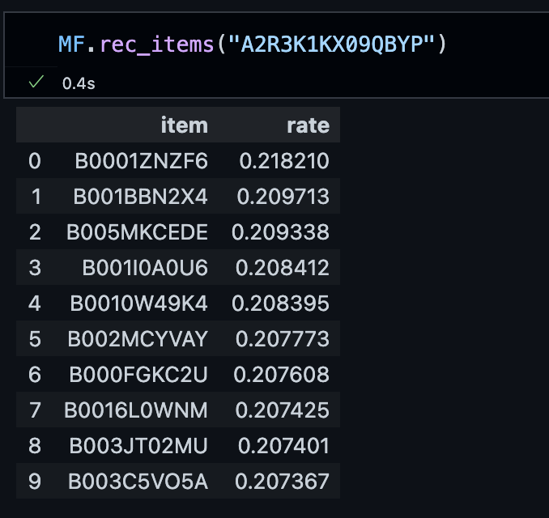

# Sinopac Recsys
## Repository Structure
```
.
├── examples
│   ├── __init__.py
│   ├── mf_example.py
│   ├── ncf_example.py
│   └── vaecf_example.py
├── experience
│   ├── classifier
│   │   ├── ClassifiersResult.ipynb
│   │   ├── ClassifiersTest-Copy1.ipynb
│   │   ├── ClassifiersTest-Copy2.ipynb
│   │   ├── ClassifiersTest-Copy3.ipynb
│   │   ├── ClassifiersTest-Copy4.ipynb
│   │   ├── ClassifiersTest-Copy5.ipynb
│   │   ├── ClassifiersTest.ipynb
│   │   ├── ClassifiersTest-xgboost.ipynb
│   │   └── model_with_diff.ipynb
│   ├── collaborative_filtering
│   │   ├── do_cf_group.ipynb
│   │   ├── mf_prob_history.ipynb
│   │   ├── mf_prob.ipynb
│   │   ├── MFResult.ipynb
│   │   ├── MFTest.ipynb
│   │   └── mf_torch.ipynb
│   ├── explainble
│   ├── mf_example.ipynb
│   └── others
│       ├── best_sell_cover_rate.ipynb
│       ├── merge_by_yyyymm.py
│       ├── result_json2csv.ipynb
│       ├── shap.ipynb
│       ├── SMOTE-Scatter.ipynb
│       ├── trans_sell_analysis.ipynb
│       └── trans_stock_analysis.ipynb
├── img
│   └── MF_pred.png
├── log
│   ├── history-log.json
│   ├── k-log.json
│   ├── log.json
│   └── model_score_log
├── README.md
└── recs
    ├── backtest.py
    ├── clf.py
    ├── data
    ├── datasets
    │   ├── attribution.py
    │   ├── base.py
    │   ├── __init__.py
    │   └── preprocess.py
    ├── __init__.py
    ├── metrics
    │   └── base.py
    ├── models
    │   ├── base.py
    │   ├── __init__.py
    │   ├── mf
    │   │   ├── __init__.py
    │   │   └── mf.py
    │   ├── ncf
    │   │   ├── __init__.py
    │   │   ├── ops.py
    │   │   ├── recom_gmf.py
    │   │   ├── recom_mlp.py
    │   │   ├── recom_ncf_base.py
    │   │   └── recom_neumf.py
    │   └── vaecf
    │       ├── __init__.py
    │       ├── recom_vaecf.py
    │       └── vaecf.py
    └── utils
        ├── common.py
        ├── config.py
        ├── __init__.py
        └── path.py

```
## How to inference:
- 在 `./examples/` 中有較簡便的使用示範
### Common
- df 資料格式：
    | user | item| rate |
    |-|-|-|
    | USER A | ITEM 1 | 1 |
    | USER B | ITEM 2 | 1 | 
    | USER B | ITEM 3 | 1 | 
### MF's Inference
- 範例程式碼
  ```python
  # import MF模型
  from recs.models.mf import MatrixFactorization 
  
  # 訓練模型
  MF = MatrixFactorization(df, svds_k = 15)

  # 預測
  u = df.user.tolist()[0]
  MF.rec_items(u)
  ```
- 預測結果示意圖

  
  
### VAECF's Inference
- 範例程式碼
  ```python
  import recs

  # 讀取資料給 Dataset
  train_set = recs.datasets.Dataset.from_uir(df.values, seed=35)

  # 初始化模型
  vaecf = recs.models.VAECF(
    k=10,
    autoencoder_structure=[20],
    act_fn="tanh",        # activate function
    likelihood="mult",    # 論文提到效果最好是使用 multinomial likelihood
    n_epochs=30,
    batch_size=30,
    learning_rate=0.001,
    beta=1.0,
    seed=35,
    use_gpu=True,
    verbose=True,
  )

  # 訓練
  vaecf.fit(train_set)

  # 預測
  pred = predict_ranking(vaecf, df, 'userId', 'itemId', 'rank', True)
  ```

## Parameters Details
MF與VAECF模型可調整參數細節寫在 models 資料夾各別模型中